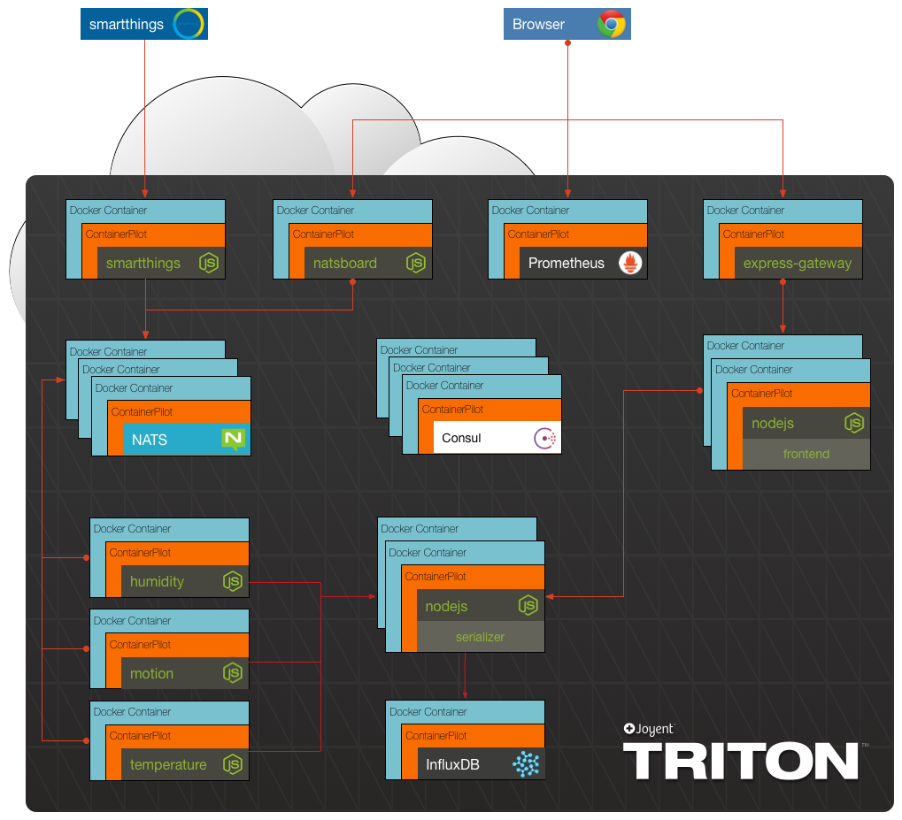

## Summary

Example microservices implementation using Node.js and Docker. Below is an architectural diagram depicting the composition of services that make up the project. When everything is working a frontend web application is accessible that will display a set of graphs using sensor data. The sensor data is either generated by the smartthings microservice or is sent to the microservice from a SmartThings hub running a Sensor SmartApp.

## Challenges

1. Ensure that node is working properly, startup the frontend
2. Ensure that docker is working properly, startup the frontend with docker
3. Ensure that docker-compose is installed and working, startup the gateway and frontend
4. ContainerPilot is introduced. Used to scale the frontend behind the gateway
5. The biggest challenge, this will add smartthings, nats, a worker (temperature), serializer, and influxdb
6. Add the humidity and motion workers
7. Add prometheus and connect telemetry

## Credits

This project is inspired by various microservices workshops and trainings. In no particular order, they are:
* https://github.com/lloydbenson/microservices-workshop - Lloyd Benson
* https://github.com/nearform/micro-services-tutorial-iot - nearForm
